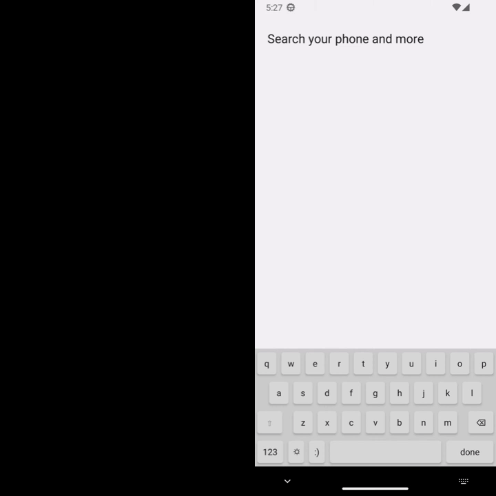
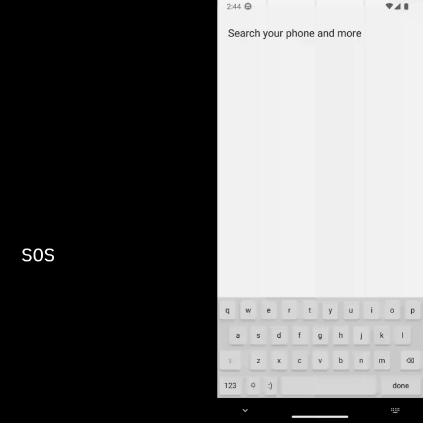
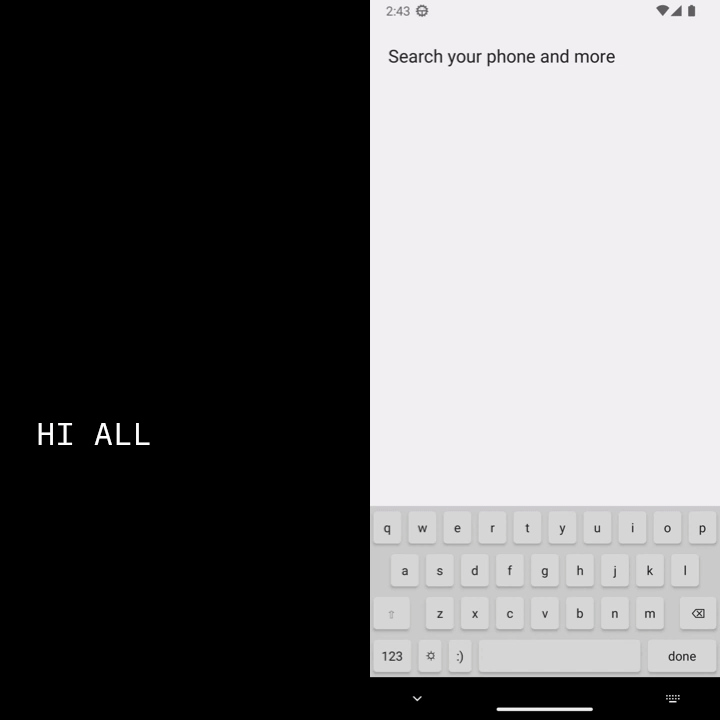

## Overview

This is an android keyboard that haptic corresponding morse code as user types. It aims to accelerate new morse code learner build up a sense of character pattern recognition instead of counting "dit"s & "dat"s.

For how morse code lookup table, timing, & technical details, please see [DevNotes](./DevNotes) folder.

## Demo

Alright, for the sake of this demonstration, I've thrown in a blinking square to help you visualize that haptic feedback. Plus, I've dialed down the speed to a leisurely 5 words per minute.

Now, the vast expanse of meticulously crafted guides on this topic can be easily found with a quick Google search. However, bear with me as I briefly cover the fundamentals, just to make sure we`re all on the same page.

### The dit, the dah, and the 1 unit pause in between

You can think of Morse code as a sequence of `bits`, where a `0` represents silence, and a `1` signals a buzz. The key distinction lies in the duration of these signals; a `dit` lasts for 1 single unit `.`, while a `dah` stretches out for 3 units `___`, with 1 unit silence marking the gap between them.

Here's an `Q` ( `_.__`) for you and take note of how quickly that `dit` disappears:

### The 3 units pause between letters

Now, let's delve into the famous distress signal, `SOS`, and its elegance in Morse code.

Have you ever wondered why 'SOS' is the universally recognized distress call? It's because of its sheer simplicity! The letter `O` consists of three `dahs` ( \_ \_ \_ ), and `S` is represented by three `dits` ( . . . ). Consequently, `SOS` translates to `dit dit dit dah dah dah dit dit dit`, or as I like to put it, `short short short, long~ long~ long~, short short short`. You see, you don't even need to be a Morse code expert to decipher it!

But there's a crucial distinction to be made. The pause between signals (the one between the `dots` in . . . ) differs from the pause between letters, like the one between `S` and `O`. Without this distinction, we might mistake `SOS HELP` with `I AM HIS DATE`. Special thanks to celtschk for this [example](https://cs.stackexchange.com/a/34083)

Let's illustrate this with `SOS`:

### The 7 units pause between words

And let's not forget about the space; spaces come with a pause of 7, ensuring we don't suffocatewhiletryingtodecodesentenceslikethis:

